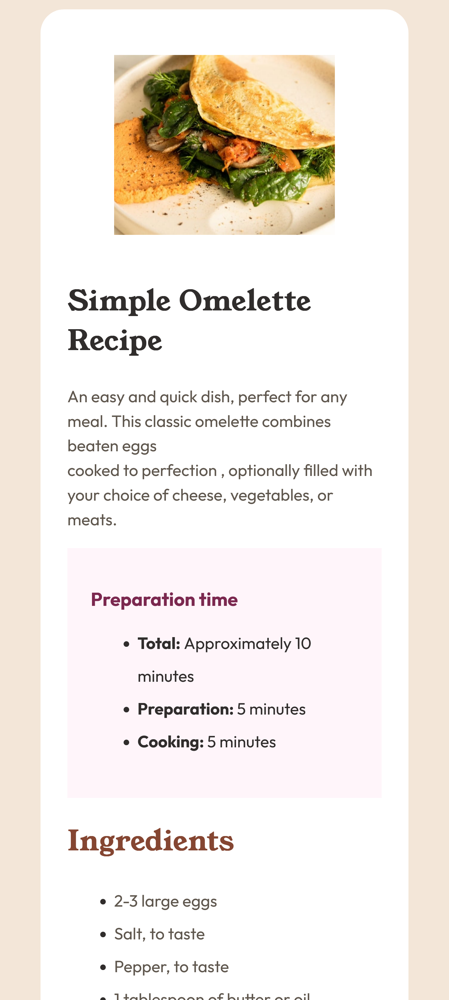

# Recipe

## Overview

### Screenshot

### Links

- Solution URL: [https://github.com/RachelAbit/Recipe](https://your-solution-url.com)
- Live Site URL: [https://rachelabit.github.io/Recipe/](https://your-live-site-url.com)

## My process

First, I started to build the basic HTML structure. Second, I used CSS styling to embed the appropriate design of the project. Since I already knew some of the fundamentals of CSS, I didn't face a major challenge. I encountered a little difficulty with the table part and the ordered list. I used CSS functions for responsiveness.

### Built with

- Semantic HTML5 markup
- CSS custom properties
- Flexbox
- CSS Functions

### What I learned

I learned that using appropriate semantic tags is very helpful when creating a webpage, and I discovered that using CSS functions makes my website dynamically change whenever the size becomes small. Although CSS functions are pretty useful, they're still not enough to optimize the responsiveness of a webpage because there are still limitations, so I'm still considering using media queries in the future.

### Continued development

For continued development, I really want to:
1. Use the tailwind.
2. Learn about media queries.
3. Use the CSS processor.

## Author

- Frontend Mentor - [@RachelAbit](https://www.frontendmentor.io/profile/RachelAbit)
